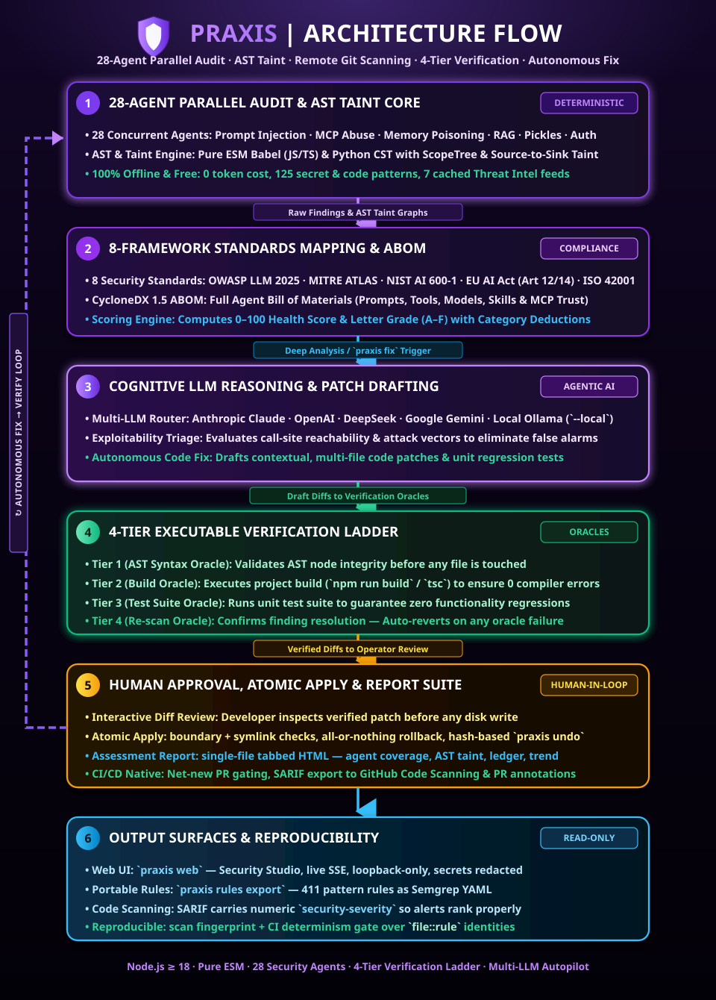

# Praxis

<p align="center">
  
</p>

<p align="center">
  <a href="https://github.com/Ganron007/Praxis/actions/workflows/ci.yml"></a>
  <a href="https://github.com/marketplace/actions/praxis-security-scan"></a>
  <a href="LICENSE"></a>
  =18.0.0">
  
  
</p>

**Praxis scans AI applications and codebases, helps you review fixes, and verifies the changes.** Its 28 built-in scanners cover LLM integrations, agents, MCP servers, RAG pipelines, model files, secrets, and common code vulnerabilities. Static analysis runs locally; optional LLM analysis and live probes extend the workflow.

> [!IMPORTANT]
> For a local static scan, run `praxis scan . --no-ai --no-deps`.
> Default scans audit dependencies over the network and may classify findings with a configured LLM provider.
> Deep analysis, LLM fixes, feed updates, credential verification, Git clones, and live probes can contact external services.
> Review provider configuration and proposed changes before using these features on sensitive projects.

## Install

```bash
npm install -g praxis-sec
praxis --version
```

Requires Node.js 18 or newer. The npm package is **`praxis-sec`**; it installs the **`praxis`** command. Static scanning needs no account or API key. LLM features require a configured cloud or local provider.

GitHub releases and npm publication are separate. The [1.2.4 release notes](docs/RELEASE-1.2.4.md) describe this patch; the npm badge shows the version currently published to npm. To use a GitHub release before npm publication, install its attached package tarball, or check out the tag and run `npm ci` followed by `node cli/bin/praxis.js --version`.

## Quick start

```bash
praxis scan . --no-ai --no-deps # local static audit
praxis scan .                  # full audit, including dependency CVEs
praxis scan ci . --fail-on high # fail on high/critical findings or an incomplete scan
praxis fix .                   # interactive LLM-guided fixes
praxis scan redteam . --no-ai   # static adversarial scanners
praxis agents audit .          # agent configuration audit
praxis web                     # local web UI
praxis rules list              # rule inventory
praxis intel update            # refresh threat feeds over the network
```

Scan roots must be directories. Use `praxis --help` and each command's `--help` for available options. Running `praxis` without arguments on a terminal opens the interactive REPL.

## What it does

| Capability | Coverage |
| --- | --- |
| AI and agent scanning | Prompt injection, MCP tool abuse, agent memory, model deserialization, RAG, telemetry, agent configuration, and infrastructure inventory |
| Code analysis | Patterns, JS/TS and Python parsing, lexical scopes, intra-file taint tracking, and guardrail detection |
| Fix workflow | Proposed diffs, approval, atomic writes, available project checks, complete re-scans, failed-fix rollback, and an undo ledger |
| Live testing | `praxis redteam <endpoint>` for LLM endpoint probes; `praxis agents mcp --test-live` for MCP runtime checks |
| Threat intelligence | Cached advisory and exploit data, a bundled AI threatpack, and optional keyed providers |
| Standards mapping | OWASP LLM/ML/Agentic, MITRE ATLAS, NIST AI 600-1, AVID, EU AI Act, ISO 42001, and Google SAIF references |
| Reports | JSON, SARIF, HTML, Markdown, CSV, and print-rendered PDF |
| CI integration | Severity/score gates, baseline and net-new PR comparison, SARIF upload, and PR summaries |
| Portable rules | Pattern exports with a manifest describing features that cannot be represented as Semgrep rules |

<p align="center">
  
</p>

## Commands

```text
praxis scan       full · git · secrets · changed · env · redteam · standard · ci
praxis fix        interactive · quick · from-report · rotate · undo · env-template
praxis agents     audit · skill · mcp · bom · serve
praxis intel      update · deps · advisories
praxis report     team · legal · checklist · sbom · benchmark
praxis project    init · doctor · hooks · guard · watch · baseline · memory · playbook · plugins · policy
praxis rules      list · export · import
praxis web        local scan UI
```

`praxis scan redteam <directory>` scans source code. `praxis redteam <endpoint>` sends probes to a live endpoint; use it only on targets you are authorized to test.

## Scan status and interpretation

Full-scan JSON exposes `scanComplete`, `scanErrors`, and `dependencyAudit`. An incomplete scan exits unsuccessfully and cannot verify a fix. A deliberately skipped dependency audit is reported as `skipped`; it provides no dependency assurance.

A normal full scan can exit successfully while reporting findings. Use `scan ci` or `--fail-below` to enforce a gate. A score summarizes detected findings; it does not establish that a project is secure or compliant. Review evidence, false positives, exclusions, and enabled checks.

## LLM configuration

Praxis loads a local `.env` automatically. A configured provider can be used for finding classification; `--no-ai` disables classification. `--deep`, LLM fixes, and swarm analysis are separate features and can still use a provider.

```dotenv
OPENAI_API_KEY=replace-with-your-key
OPENAI_BASE_URL=https://your-gateway.example/v1/chat/completions
PRAXIS_LLM_MODEL=your-model
PRAXIS_LLM_REASONING=high
```

See [the environment template](.env.example) and [provider configuration](docs/USAGE.md#environment-variables). Keep real credentials out of version control. Check configuration with `praxis project doctor`.

## GitHub Action

The Action runs the code selected by its Git ref, independently of the npm latest version.

```yaml
name: Security
on: [push, pull_request]
permissions:
  contents: read
  security-events: write
  pull-requests: write
jobs:
  praxis:
    runs-on: ubuntu-latest
    steps:
      - uses: actions/checkout@3d3c42e5aac5ba805825da76410c181273ba90b1 # v7.0.1
      - uses: Ganron007/Praxis@v1.2.4
        with:
          threshold: '80'
          net-new: 'true'
          fail-on-new: 'high'
          always-fail-on: 'critical'
          sarif: 'true'
          comment: 'true'
```

On pull requests, `net-new` compares the base and head scans. Existing findings are excluded from the introduced-finding gate, but `always-fail-on` and scan failures still fail the job. On other events, the regular gate applies. SARIF and PR comments need their respective write permissions; repository settings and fork PR restrictions can limit them. Disable either integration if those permissions are unavailable.

Pin a release tag or commit for reproducibility. The floating `v1` tag tracks the maintained release line. See [CI integration](docs/USAGE.md#cicd-integration) for inputs, outputs, and plain CLI examples.

## Portable rules

```bash
praxis rules list
praxis rules export -o ./rules
semgrep --config ./rules/praxis-rules.yaml .
praxis rules import ./rules/praxis-rules.json --write-plugin .praxis/agents
```

The export manifest identifies pattern rules and explains limitations for AST/taint dataflow, probe signatures, entropy checks, and LLM analysis. Imported plugins are executable code; enable them only after review. See [custom plugins](docs/USAGE.md#custom-plugins).

## Documentation

- [Usage guide](docs/USAGE.md): commands, options, configuration, and reports
- [1.2.4 release notes](docs/RELEASE-1.2.4.md): fixes and validation
- [Release procedure](docs/RELEASING.md): versioning, gates, tags, and npm handoff
- [Threat intelligence](docs/THREAT_INTEL.md): sources, caching, and freshness
- [Third-party notices](docs/THIRD_PARTY_NOTICES.md): vendored data attribution
- [Claude Code plugin](claude-code-plugin/README.md) and [VS Code extension](vscode-extension/README.md)
- [Contributing](.github/CONTRIBUTING.md) and [security reporting](.github/SECURITY.md)

## Scope and limitations

Praxis combines static heuristics, intra-file analysis, optional LLM judgments, and live probes. Findings need review; a completed scan can miss vulnerabilities and can report false positives. Standards tags provide control references and evidence, not compliance certification. LLM verdicts are advisory, and verification depends on the available checks in the target project.

## License

MIT. See [LICENSE](LICENSE) and [third-party notices](docs/THIRD_PARTY_NOTICES.md).
